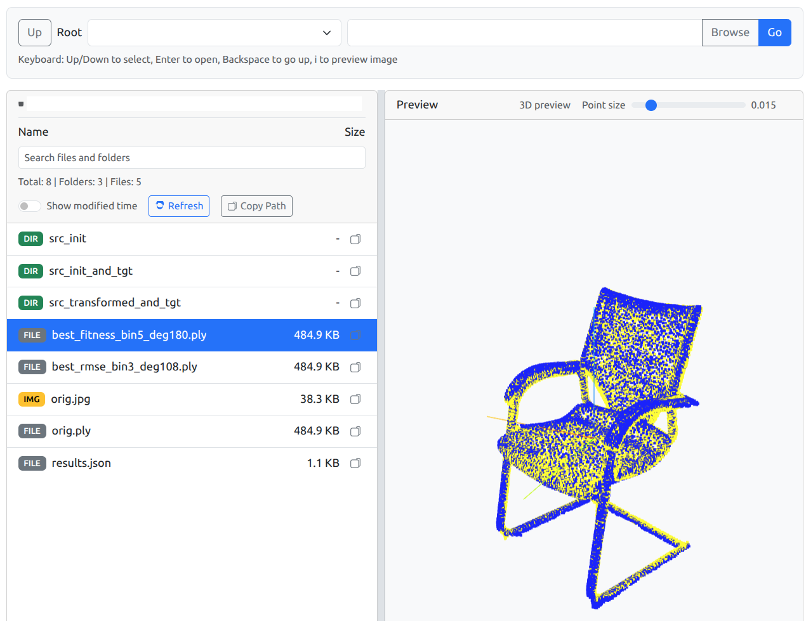

File Viewer (Flask + Vue)
=========================



Simple, lightweight file browser for Ubuntu servers with:
- Configurable allowed roots via YAML
- Directory listing with sizes
- Image preview next to the list
- Video preview with HTML5 video player
- Syntax-highlighted preview for common text formats (txt/json/md/yaml/etc.) via Highlight.js
- Interactive `.ply` mesh/point cloud preview with vertex colors using Three.js
- Keyboard navigation (Up/Down, Enter to open, Backspace to go up, i to refresh preview)

Requirements
------------
- Python 3.9+ recommended

Install
-------
```bash
python3 -m venv .venv
source .venv/bin/activate
pip install -r requirements.txt
```

Configure
---------
Edit `config.yaml` to set allowed roots:
```yaml
allowed_roots:
  - <path to dir1>
  - <path to dir2>
```

Run
---
```bash
python app.py
```

Then open `http://<server-ip>:5000/`.

Notes
-----
- The server strictly restricts access to paths under `allowed_roots`.
- Image preview uses the original file; for very large images, consider adding thumbnailing.